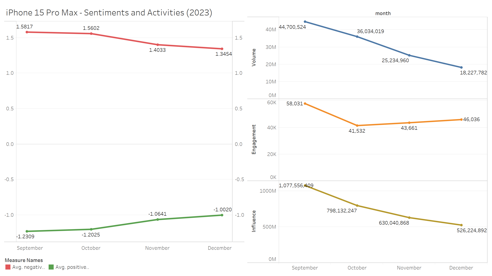
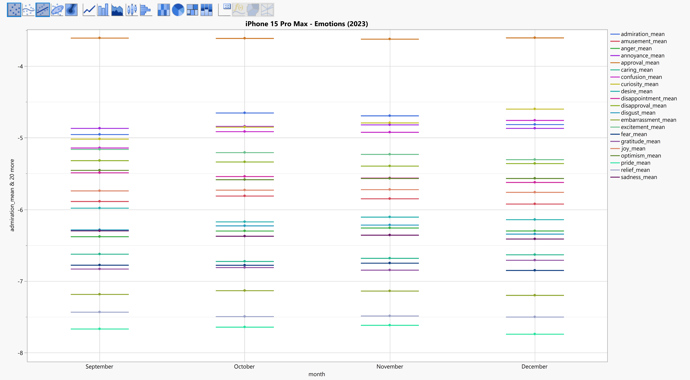
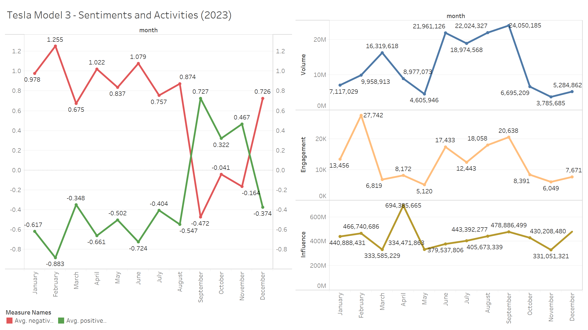
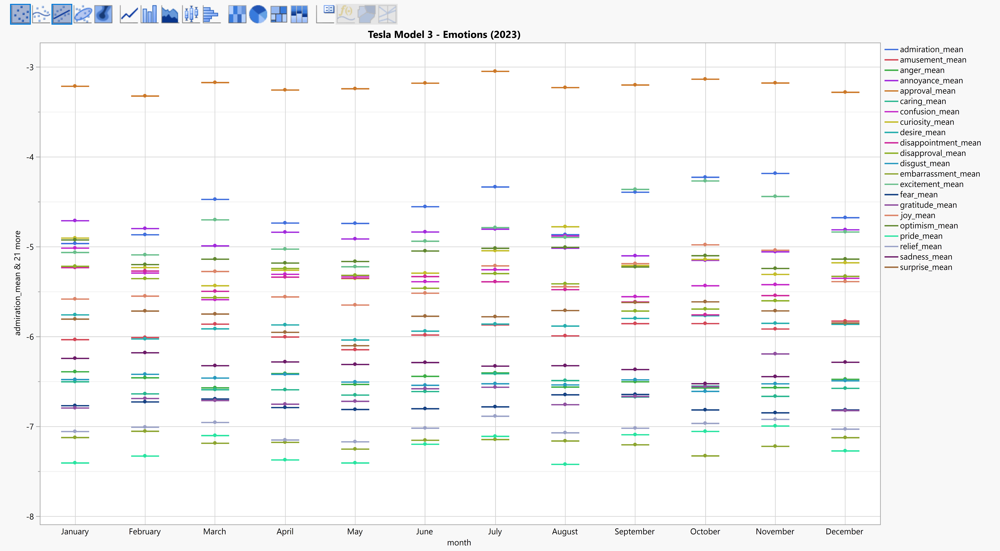

# Product Reputation Analyzer (PRA)
The purpose of this tool is to perform an in-depth analysis of a product throught social networks opinions, sentiments and atitudes towards a the product, using Large Language Model and Prompt Engineering.

## Description
Social networks contain valuable information about user experiences of using a particular product - such as problems, malfunctions, sentiments, general issues and any other type of criticism. This information is important for businesses that want to understand what internet users or customers on social networks thinks about their current product on the market, so that they can improve it. relevant to business and data analysts, particularly those focused on product management, marketing strategy, and customer relations. The use of KPIs derived from social media analytics is increasingly crucial in understanding and predicting consumer behavior and market trends.

The first step is to extract data from a social network that contain posts or comments mentioning a keyword of a certain product - this can be done through requests from official API services the social networks provide (Twitter, Facebook or Reddit for example). this data is then "fed" into the algorithm as input. it includes the content of the posts or comments, dates, usernames, number of views, number of shares, etc.

Our algorithm is using a Large Language Model (Gemini Pro) that extracts unique KPI measurements from the data in order to provide relevant and important insights for a given product. it also extracts the main criticisms toward the product. by utilizing the Large Language Model, it collects all the criticisms, assemble them, making generalizations, and lists the most frequently mentioned problems or issues the users or customers relation to the product.   

Sentiments and Emotions are extracted using two finetuned variations of BERT language model, which were evaluated with high accuracy of over 95% on the GoEmotions and SST-2 datasets.

At this point, the algorithm only supports the social network Twitter (X).

Here are the algorithm steps:    
1. Extracting data from one of the social networks using the official API service (posts, comments, tweets, usernames, dates, views, likes, shares, etc.).
2. Utilizing AI/LLM with Prompt Engineering for extracting criticisms about the product from posts or comments.
3. Utilizing AI/LLM with Prompt Engineering for extracting sentiments and emotions of user's posts or comments mentioning their experience with the product.
4. Clustering the criticsms into N-number of the most frequent topics (issues, problems, etc.).
5. Assembling a report with the list of the main problems, issues, or criticisms and providing unique KPI metrics.

## Algorithm steps
Loading fetched Dataset -> Cleaning texts -> Extracting all Criticisms and Emotions -> Summarizing the criticisms into main topics and analyzing KPIs    
    

    
## Available KPI list (Twitter/X)
#### Activities:
- Volume:   
  represents the total amount of activity on the social network (views + quotes + replies + retweets + bookmarks + favorites).   
  more mentions can lead to increased brand visibility and consequently, more sales opportunities.      
- Engagement:   
  represents the total amount of user engagement (quotes + replies + retweets).
  higher engagement can foster product spreading and popularity, so more engagment mean more product noticeability.     
- Influence:   
  Represents the level of influence through the amount of the tweets that mention the product together with the number of the users number of followers (Average Followers Count × Tweet Count).
   being influential can help the product becoming a preferred brand, which can boost profit margins. 
#### Sentiments:
- Positive Sentiment:   
  How much the tweets are reflecting a positive attitude toward the product (a probability number 0-1).
  positive sentiment can be amplified to attract new customers and retain existing ones, improving sales. this also can suggest the current magnitude of positivity of the product.   
- Negative Sentiment:   
  How much the tweets are reflecting a negative attitude toward the product (a probability number 0-1).
  Addressing negative feedback promptly can prevent loss of customers and damage to brand reputation.    
#### Emotions:
- Emotions expressed in tweets about a product can provide valuable insights into customer sentiment, helping businesses understand public perception and satisfaction. These insights can guide marketing strategies, product development, and customer service initiatives to better align with consumer needs and preferences.   
- The GoEmotions dataset categorizes texts into 27 distinct emotion categories. These include emotions such as admiration, amusement, anger, annoyance, approval, caring, confusion, curiosity, desire, disappointment, disapproval, disgust, embarrassment, excitement, fear, gratitude, grief, joy, love, nervousness, optimism, pride, realization, relief, remorse, sadness, and surprise. 
    

